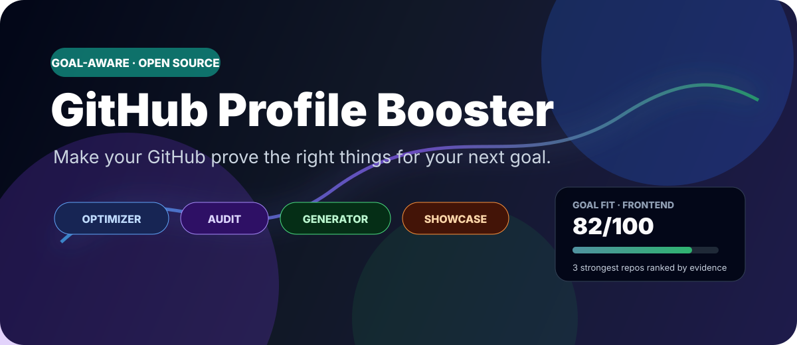
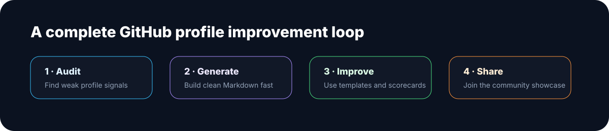

# GitHub Profile Booster 🚀

<p align="center">
  
</p>

<p align="center">
  <a href="https://github.com/tec-2022/github-profile-booster/stargazers"></a>
  <a href="https://github.com/tec-2022/github-profile-booster/network/members"></a>
  <a href="https://github.com/tec-2022/github-profile-booster/actions/workflows/quality.yml"></a>
  <a href="./LICENSE"></a>
  <a href="https://github.com/tec-2022/github-profile-booster/commits/main"></a>
</p>

<p align="center">
  <strong>Do not just decorate your GitHub profile. Make it prove the right things.</strong><br />
  Career-signal mapping, goal-aware profile analysis, repository ranking and evidence-based README generation — free and open source.
</p>

<p align="center">
  <a href="https://tec-2022.github.io/github-profile-booster/career-map.html"><strong>🧭 What does my GitHub say?</strong></a> ·
  <a href="https://tec-2022.github.io/github-profile-booster/optimizer.html"><strong>🎯 Optimize for my goal</strong></a> ·
  <a href="https://tec-2022.github.io/github-profile-booster/audit.html"><strong>🔎 Quick audit</strong></a> ·
  <a href="https://tec-2022.github.io/github-profile-booster/generator.html"><strong>✨ README generator</strong></a> ·
  <a href="https://github.com/tec-2022/github-profile-booster"><strong>⭐ Star</strong></a> ·
  <a href="./docs/es/README.md"><strong>Español</strong></a>
</p>

<p align="center">
  <sub>No signup · No private repositories · No API key · Public GitHub data only · MIT licensed</sub>
</p>

---

## 🧭 Career Signal Map: what does your GitHub currently prove?

Your intended career direction and the story visible in your repositories are not always the same.

The **Career Signal Map** compares your original public repositories across multiple directions at the same time:

- Frontend
- Backend
- Full Stack
- Data / AI
- Open Source
- Academic / Research

It answers:

> **If someone saw only my public GitHub today, what direction would the evidence point toward?**

You get a comparative signal map plus the repositories that contribute most strongly to your top directions.

Results are now **shareable by URL** and can be exported as a **1200×630 PNG signal card** for social posts, portfolios or feedback threads.

**[Open the Career Signal Map →](https://tec-2022.github.io/github-profile-booster/career-map.html)**

---

## 🎯 Flagship: Goal-Aware Profile Optimizer

Once you know what your GitHub currently communicates, choose what you **want** it to support.

Enter a public GitHub username and choose a target:

- Internship / Junior role
- Frontend
- Backend
- Full Stack
- Data / AI
- Open Source
- Academic / Research

The optimizer then:

1. **Scores five dimensions** — clarity, proof of work, freshness, goal relevance and credibility.
2. **Ranks the strongest repositories for that specific goal** instead of blindly showing the most-starred repos.
3. **Checks whether the selected repos are documented and current.**
4. **Prioritizes the highest-impact fixes** rather than returning a generic checklist.
5. **Generates an evidence-based profile README draft** using only public work it actually found.
6. **Creates a reproducible result URL** with the username and selected goal.
7. **Exports a social result card** summarizing the score, dimensions and strongest evidence.

Repeated public GitHub API requests are cached locally for a short period to reduce unnecessary calls and make repeated analysis smoother.

**[Open the Goal-Aware Optimizer →](https://tec-2022.github.io/github-profile-booster/optimizer.html)**

> Scores are presentation heuristics, not measures of programming ability, employability or career potential.

---

## Why this is different

A lot of excellent profile tooling is optimized for **adding things**: badges, trophies, streaks, widgets, stats cards and animated sections.

GitHub Profile Booster is deliberately built around **evidence, positioning and direction**.

| Typical profile tool | GitHub Profile Booster |
| --- | --- |
| “Which widgets do you want?” | “What does your GitHub currently prove?” |
| One generic profile | Compare multiple career signals first |
| Uses projects you manually enter | Ranks existing public repos for the selected goal |
| Generates a prettier README | Generates a README grounded in public evidence |
| More visual elements = more complete | Proof, relevance and clarity matter more than decoration |
| Static checklist | Prioritized fixes based on what your profile actually contains |

The objective is not to create the loudest README. It is to create one a visitor can **understand and verify quickly**.

---

## Four tools, one improvement loop

### 🧭 1. Career Signal Map

Best when you want to discover **what story your public GitHub tells today** before deciding what to optimize.

**[Map my career signals →](https://tec-2022.github.io/github-profile-booster/career-map.html)**

### 🎯 2. Goal-Aware Optimizer

Best when you already know your target and want to know **which repos should represent you**.

**[Run goal-aware analysis →](https://tec-2022.github.io/github-profile-booster/optimizer.html)**

### 🔎 3. Quick Profile Audit

Best when you only want a fast check of the public profile README itself.

It checks ten practical signals such as identity, structure, stack, proof of work, links and current focus.

**[Audit a profile →](https://tec-2022.github.io/github-profile-booster/audit.html)**

### ✨ 4. README Generator

Best when you want manual control. Choose your details, stack and style, then copy or download the generated Markdown.

**[Generate a README →](https://tec-2022.github.io/github-profile-booster/generator.html)**

The full loop is:

```text
map what GitHub currently communicates
→ choose a goal
→ analyze real public work
→ select the strongest evidence
→ generate / edit README
→ publish
→ re-audit
→ improve
```

---

## What the optimizer evaluates

### Clarity
Can a visitor understand who you are and what you focus on quickly?

### Proof of work
Do your strongest claims lead to public repositories, demos or documented artifacts?

### Freshness
Does the profile show work that still reflects what you can do now?

### Goal relevance
Would the visible projects make sense for the role or direction you selected?

### Credibility
Are the featured repositories documented, maintained and supported by visible public activity?

---

## Before → after

| Before | After using the toolkit |
| --- | --- |
| “I think my GitHub looks Full Stack.” | Career Signal Map shows what the evidence actually emphasizes |
| “I know React, Python, C#, Docker...” | “These three repos best prove the stack relevant to my target.” |
| Random featured work | Goal-aware repository shortlist |
| Old projects mixed with current work | Freshness is surfaced explicitly |
| Generic README | Goal-specific positioning |
| Decorative badges without context | Evidence-linked project descriptions |
| “My profile is 7/10” | “These are the fixes with the highest impact.” |
| README written from memory | Draft based on public repositories actually found |
| Screenshot-only result | Reproducible URL + downloadable social card |

<p align="center">
  
</p>

---

## Everything in the toolkit

| Resource | What it does |
| --- | --- |
| [Career Signal Map](https://tec-2022.github.io/github-profile-booster/career-map.html) | Compare multiple career directions and export a shareable signal card |
| [Goal-Aware Optimizer](https://tec-2022.github.io/github-profile-booster/optimizer.html) | Career-goal analysis, repo ranking, prioritized fixes, shareable results and evidence-based draft |
| [Quick Profile Audit](https://tec-2022.github.io/github-profile-booster/audit.html) | 10-signal public README heuristic |
| [README Generator](https://tec-2022.github.io/github-profile-booster/generator.html) | Browser-based Markdown builder with copy/download |
| [Community Showcase](https://tec-2022.github.io/github-profile-booster/showcase.html) | Public entry point for real before/after examples |
| [`templates/`](./templates) | 60-second, Pro, Minimal and Bilingual templates |
| [`docs/profile-scorecard.md`](./docs/profile-scorecard.md) | Manual 10-point audit |
| [`docs/profile-checklist.md`](./docs/profile-checklist.md) | Pre-publish quality control |
| [`docs/badges.md`](./docs/badges.md) | Focused stack and profile badge snippets |
| [`docs/public-repo-ideas.md`](./docs/public-repo-ideas.md) | Safe public-project ideas |
| [`docs/launch-plan.md`](./docs/launch-plan.md) | Make a public repository easier to understand and share |
| [`SHOWCASE.md`](./SHOWCASE.md) | Maintained community showcase list |

---

## Quality and safety

Every push and pull request runs a lightweight GitHub Actions check that validates:

- Required public pages exist.
- Inline JavaScript parses successfully.
- Basic page metadata is present.
- Relative links between local pages resolve.
- The main README references the flagship tools.

The public pages also escape user-controlled repository text before inserting it into generated HTML views.

---

## Design principles

### Evidence first
A technology badge is a claim. A maintained repository with a useful README is evidence.

### Goal aware
There is no single “best GitHub profile”. A Data/AI profile should foreground different evidence than a Frontend or Open Source profile.

### Diagnose before decorating
The toolkit first asks what the public evidence communicates, then helps you decide what to change.

### Focus over badge soup
A visitor should not need to decode 40 icons before finding your strongest project.

### Public and verifiable
The optimizer drafts from data it can actually see. It does not invent private projects, stars or experience.

### Privacy conscious
The browser tools work with information intended for a public GitHub profile. Never publish secrets, credentials, private database URLs, personal data or proprietary code.

---

## Community showcase 🌟

Used the toolkit to improve your public profile? Submit it voluntarily to [`SHOWCASE.md`](./SHOWCASE.md) or browse the [Showcase page](https://tec-2022.github.io/github-profile-booster/showcase.html).

The goal is to build a library of **real profiles with different objectives**, not make everyone look identical.

---

## Contributing

Useful contributions include:

- Improve career-signal heuristics.
- Improve goal-ranking heuristics.
- Add a new career lens.
- Improve repository scoring.
- Add accessible generator options.
- Improve multilingual support.
- Submit a real before/after profile example.
- Fix wording, links or accessibility issues.

Start with the [good first issue](https://github.com/tec-2022/github-profile-booster/issues/4) or read [`CONTRIBUTING.md`](./CONTRIBUTING.md).

---

## Support the project

If the tools help you, a GitHub star is the simplest way to support the project and bookmark it for later.

<p align="center">
  <a href="https://github.com/tec-2022/github-profile-booster"><strong>⭐ Star GitHub Profile Booster</strong></a> &nbsp; · &nbsp;
  <a href="https://tec-2022.github.io/github-profile-booster/career-map.html"><strong>🧭 Map my signals</strong></a> &nbsp; · &nbsp;
  <a href="https://tec-2022.github.io/github-profile-booster/optimizer.html"><strong>🎯 Optimize my profile</strong></a>
</p>

## License

MIT — use it, fork it, improve it and adapt it.